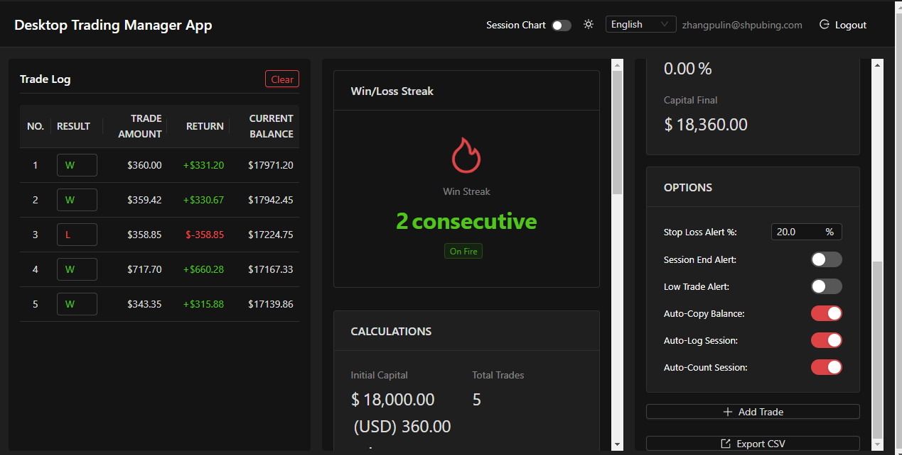

# Desktop Trading Manager App (Risk & Recovery System with Login Protection)

A desktop trading management app built with Electron, React, and TypeScript, focused on risk monitoring, drawdown recovery, and secure login protection.

## Key Features

- 📊 **Trade management**: Record and manage every trade
- 🧮 **Risk calculator**: Automatically compute risk amount, position size, and maximum contracts
- 📈 **Trading analytics**: Display total P&L, win rate, and winning/losing trade counts in real time
- 📉 **Session charting**: Visualize balance and profit/loss trends across trading sessions
- 💾 **Data persistence**: Store everything locally in a SQLite database
- 🎨 **Dark theme**: Modern, accessible UI styling

## Tech Stack

- **Electron**: Cross-platform desktop framework
- **React 18**: UI library
- **TypeScript**: Type safety everywhere
- **Vite**: Fast build tooling
- **Zustand**: Lightweight state management
- **Ant Design**: Component library
- **Recharts**: Charting primitives
- **better-sqlite3**: SQLite database driver

## Project Structure

```
trade-app/
├── src/
│   ├── main/              # Electron main process
│   │   ├── index.ts       # Entry point
│   │   ├── database.ts    # Database setup and management
│   │   └── ipc.ts         # IPC handlers
│   ├── preload/           # Preload scripts
│   │   └── index.ts       # Exposes APIs to renderer
│   ├── renderer/          # React renderer
│   │   └── src/
│   │       ├── components/     # React components
│   │       │   ├── TradeTable/       # Trade table
│   │       │   ├── CalculationsPanel/ # Risk calculator panel
│   │       │   ├── SessionChart/     # Session chart
│   │       │   └── TradeForm/        # Trade form
│   │       ├── store/           # Zustand state store
│   │       ├── services/        # Business services
│   │       └── App.tsx          # Root component
│   └── types/             # Shared TypeScript definitions
├── electron.vite.config.ts
├── package.json
└── tsconfig.json
```

## Installation & Usage

### Windows-specific Notes

**Important**: `better-sqlite3` compiles native bindings. If installation fails, try the steps below.

#### Option 1: Install or repair Visual Studio Build Tools (recommended)

If Visual Studio Build Tools are already installed but you still hit errors, consult [FIX-VS-TOOLS.md](./FIX-VS-TOOLS.md) for detailed fixes.

First-time setup:
1. Download and install [Visual Studio Build Tools](https://visualstudio.microsoft.com/downloads/#build-tools-for-visual-studio-2022)
2. Select the **Desktop development with C++** workload
3. In the install details panel make sure you include:
   - ✅ MSVC v143 - VS 2022 C++ x64/x86 build tools
   - ✅ Windows 10/11 SDK (latest)
4. Run `npm install` again

#### Option 2: Use the automated install script (quickest)

Run the bundled PowerShell script:

```powershell
# Run PowerShell as Administrator and execute:
.\install-windows.ps1
```

The script detects Visual Studio setups and attempts the best install path.

#### Option 3: Use prebuilt binaries

To avoid installing Visual Studio, you can leverage prebuilt binaries:

```powershell
# Tell npm to prefer prebuilt binaries
$env:npm_config_build_from_source="false"
npm install better-sqlite3 --build-from-source=false
npm install
```

#### Option 4: Run with elevated privileges

Native builds sometimes require admin rights:

1. Open PowerShell or Command Prompt as Administrator
2. Execute `npm install`

### 1. Install dependencies

```bash
npm install
```

### 2. Start the development environment

```bash
npm run dev
```

### 3. Build the production bundle

```bash
npm run build
```

### 4. Preview the production build

```bash
npm run preview
```

## Using the App

### Create a trade

1. Click the **New Trade** button in the top-right corner
2. Fill in the trade details:
   - Instrument (e.g., BTC/USDT)
   - Direction (long/short)
   - Quantity
   - Entry price
   - Entry time
   - Optional metadata
3. Press **Confirm** to save

### Run a risk calculation

1. In the **Risk Management Calculator** panel enter:
   - Account balance
   - Risk percentage (%)
   - Entry price
   - Stop-loss price
2. Click **Calculate**
3. Review the calculated risk amount, maximum position size, and contract count

### Review analytics

- **Trading statistics panel** shows:
  - Total profit and loss
  - Win rate
  - Number of winning trades
  - Number of losing trades

- **Session chart** visualizes balance and profit/loss trends

## Database

The app stores all data in a SQLite database under a `database` directory:
- **Packaged builds:** `database/trades.db` stored next to the application executable
- **Development runs:** `database/trades.db` stored in the project working directory

Ensure the app has permission to create the `database` directory on first launch.

## Development

### Main process

Main-process code lives in `src/main/` and handles:
- Window lifecycle management
- Database access
- IPC routing

### Renderer process

Renderer code is in `src/renderer/`, built with React.

### IPC communication

The main and renderer processes communicate via IPC:

- Renderer calls: `window.electronAPI.methodName()`
- Main process handlers: defined in `src/main/ipc.ts`

## License

MIT


